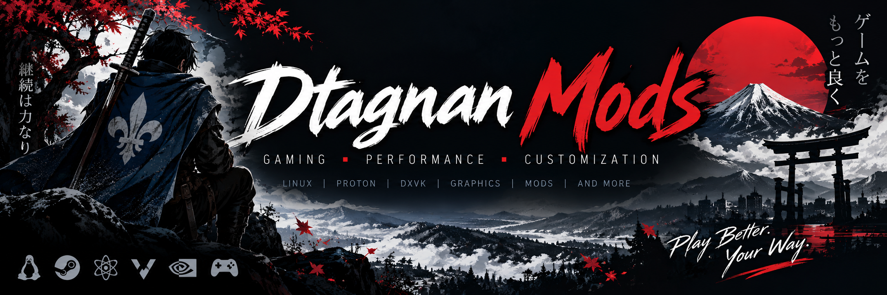

<p align="center">
  
</p>
<div align="center">

# Dtagnan Mods — No More Heroes

### Linux Enhancement Package

**Custom DXVK build · SMAA · Color LUT · Bloom · Vignette · CAS · Dithering**

**Version 1.1**

</div>

---

## Overview

This project improves the Linux experience of the Windows release of
**No More Heroes** running through Steam and Proton.

The package combines a game-specific 32-bit DXVK build with a restrained
vkBasalt post-processing chain. Its goal is to improve frame pacing, edge
quality, color reproduction and image clarity without replacing the visual
identity of the original game.

Linux is required. This is not a Windows mod or Windows installer.

## Before and after


| Original presentation | Dtagnan Mods post-processing |
|:---:|:---:|
|  |  |


## What the mod installs

### Custom DXVK

The included 32-bit DXVK libraries translate the game's Direct3D 11 rendering
to Vulkan. The build contains a profile specifically matched to `nmh.exe`:

- maximum frame latency of one frame;
- four shader compiler threads;
- DXVK present timing enabled;
- implicit resolves enabled.

### vkBasalt post-processing

The final Vulkan image is processed in this order:

```text
SMAA → Color LUT → Bloom → Vignette → CAS → Dithering
```

| Effect | Purpose |
|---|---|
| SMAA | Smooths visible jagged edges. |
| Color LUT | Adjusts color, contrast and midtones for the game's presentation. |
| Bloom | Adds a subtle glow around bright areas. |
| Vignette | Slightly darkens the outer corners. |
| CAS | Restores fine detail and controlled sharpness. |
| Dithering | Reduces color banding in skies and gradients. |

Press **F10** while playing to enable or disable the complete post-processing
chain.

## Compatibility

The installer supports:

- native Steam for Linux;
- the standard Steam Flatpak installation;
- Steam Deck and SteamOS without disabling the read-only system image;
- Steam's primary library;
- additional libraries and Steam Deck microSD cards declared in
  `libraryfolders.vdf`, including current and legacy formats;
- NVIDIA hybrid graphics, NVIDIA-only, AMD and Intel systems;
- custom XDG data and configuration directories;
- installation paths containing spaces;
- installation paths containing Unicode characters and symbolic links;
- an explicitly supplied game directory.

Snap Steam is detected but intentionally refused because its confined
filesystem cannot currently be supported safely.

NVIDIA PRIME variables are added only when a hybrid NVIDIA system is detected.
AMD, Intel and NVIDIA-only systems receive vendor-appropriate launch options
without unnecessary PRIME variables.

## Requirements

- A 64-bit Linux distribution
- Steam for Linux or Steam Flatpak
- No More Heroes on Steam — App ID `1420290`
- Proton or GE-Proton selected as the compatibility tool
- A Vulkan-capable GPU and working Vulkan driver
- 64-bit and 32-bit Vulkan userspace support
- vkBasalt with its 32-bit Vulkan layer
- Bash and standard GNU/Linux command-line tools
- Optional: `chafa` for terminal image previews

The executable `nmh.exe` is 32-bit. A system with only 64-bit Vulkan or
vkBasalt libraries is therefore incomplete. The installer verifies the 32-bit
Vulkan loader and vkBasalt layer before modifying the game.

### Fedora

```bash
sudo dnf install vkBasalt.i686 vulkan-loader.i686

# AMD or Intel with Mesa
sudo dnf install mesa-vulkan-drivers.x86_64 mesa-vulkan-drivers.i686

# NVIDIA with the RPM Fusion proprietary driver
sudo dnf install xorg-x11-drv-nvidia-libs.x86_64 xorg-x11-drv-nvidia-libs.i686

# Optional terminal image previews
sudo dnf install chafa
```

### Arch Linux

Enable the official `[multilib]` repository, then install the 32-bit Vulkan
loader and the matching 32-bit Vulkan driver for the GPU:

```bash
sudo pacman -S --needed lib32-vulkan-icd-loader
```

A compatible 32-bit vkBasalt build is also required. It is not provided by the
standard Arch repositories used by the automated container test.

### Debian and Ubuntu derivatives

Enable the `i386` architecture before installing the distribution's Vulkan and
vkBasalt packages:

```bash
sudo dpkg --add-architecture i386
sudo apt update
```

Package names and vkBasalt availability vary between releases. Confirm that a
32-bit `libvulkan.so.1`, 32-bit `libvkbasalt.so`, and the matching 32-bit GPU
driver are available.

The installer can configure `i386` and install `libvulkan1:i386`
automatically. A compatible 32-bit vkBasalt build may still require a manual
installation.

### openSUSE

The installer can install the 32-bit Vulkan loader automatically:

```bash
sudo zypper install libvulkan1-32bit
```

A compatible 32-bit vkBasalt build is also required. `vkBasalt-32bit` was not
available from the standard Tumbleweed repositories used by the automated
container test.

### Steam Deck and SteamOS

Steam Deck native Steam, internal storage and registered microSD libraries are
supported. The installer never disables SteamOS read-only mode and never
modifies the immutable system image.

If the required 32-bit Vulkan loader or vkBasalt layer is missing, installation
stops before changing the game. A user-local 32-bit vkBasalt installation is
detected in locations such as:

```text
~/.local/lib32/libvkbasalt.so
~/.local/lib/vkbasalt/libvkbasalt.so
~/.local/lib/libvkbasalt.so
```

### Steam Flatpak

Steam Flatpak requires a vkBasalt Vulkan-layer extension inside its Flatpak
runtime, including its `i386` architecture. Installing vkBasalt only on the host
system is not sufficient for the Flatpak version of Steam.

External Steam libraries declared by Flatpak are detected automatically. For a
completely custom external layout, force Flatpak paths explicitly:

```bash
DTAGNAN_STEAM_FLATPAK=1 \
./install.sh install "/external/path/steamapps/common/No More Heroes"
```

## Installation

1. Download and extract the complete release.

2. Keep these items together:

   ```text
   Comparison/
   DXVK/
   vkBasalt/
   install.sh
   README.md
   SHA256SUMS
   ```

3. Open a terminal in the extracted directory.

4. Make the installer executable and start it:

   ```bash
   chmod +x install.sh
   ./install.sh
   ```

5. Select **Install or update the mod**.

6. Select **Show Steam launch options** and copy the complete generated line
   into:

   **Steam → Library → No More Heroes → Properties → General → Launch Options**

7. Start the game normally from Steam.

Do not run the installer with `sudo`. It intentionally refuses root execution
to prevent files from being installed in root's home directory.

## Direct commands

```bash
./install.sh install
./install.sh verify
./install.sh restore
./install.sh options
./install.sh about
./install.sh compare
./install.sh doctor
./install.sh test-deps
```

For an unusual Steam layout, provide the game directory explicitly:

```bash
./install.sh install "/path/to/steamapps/common/No More Heroes"
```

On distributions using nonstandard library locations, explicit paths can be
provided without modifying the installer:

```bash
VULKAN_LIBRARY="/path/to/32-bit/libvulkan.so.1" \
VKBASALT_LIBRARY="/path/to/32-bit/libvkbasalt.so" \
./install.sh install
```

## Verification

```bash
./install.sh verify
```

Verification checks:

- the known SHA-256 hashes of the custom DXVK DLLs;
- installed DLL contents;
- shader and LUT contents;
- effect order and runtime paths in `nmh.conf`;
- per-user restoration metadata;
- the 32-bit Vulkan and vkBasalt requirements.

The release manifest can also be checked independently:

```bash
sha256sum -c SHA256SUMS
```

## Transaction safety and crash recovery

The installer stages every DLL, configuration and backup as a temporary file
in the destination directory, then commits it with an atomic rename. This
prevents a failed copy from truncating a working file.

Additional safeguards include:

- restoration metadata is committed before the game DLLs are changed;
- `SIGINT`, `SIGHUP` and `SIGTERM` trigger rollback and temporary-file cleanup;
- an interrupted second DLL installation remains fully restorable;
- an interrupted configuration update preserves the previous configuration;
- the next installation removes stale transaction files left by an
  untrappable interruption such as power loss or `SIGKILL`.
- a failed installation restores the original DLLs and configuration
  automatically before exiting.

## Automated tests

The release includes two test programs:

```bash
./audit_crash_test.sh
./podman-platform-tests.sh --full-packages
```

The crash suite covers 107 scenarios, including installation, verification,
uninstallation, interrupted writes, rollback, repeated updates, corrupt
metadata, Steam libraries, Flatpak, Steam Deck microSD paths, Unicode paths,
custom XDG directories and GPU launch options.

The full Podman matrix passed on all four tested distribution families:

| Container | Package manager | Result |
|---|---:|---:|
| Fedora | `dnf` | Passed |
| Ubuntu | `apt` | Passed |
| Arch Linux | `pacman` | Passed |
| openSUSE Tumbleweed | `zypper` | Passed |

These containers validate distribution packaging and installer behavior. A
final test on physical Steam Deck hardware is still recommended because a
container cannot reproduce the Deck's GPU, Steam client or immutable operating
system exactly.

## Updating

Extract the new release over the existing package directory, then run:

```bash
./install.sh install
./install.sh verify
```

The original per-user backup is preserved across repeated installations and
updates.

## Restoring the original state

```bash
./install.sh restore
```

During the first installation, the installer records whether local DirectX
DLLs and an NMH vkBasalt configuration already existed:

- existing files are backed up and restored byte-for-byte;
- files created solely by the mod are removed during restoration;
- files changed by another program after installation are not deleted blindly.

Restoration data is created separately for every Linux user. No original game
DLL from the developer's computer is included or reused. After restoration,
remove the mod launch options from Steam.

## Installed locations

### Native Steam

| Component | Location |
|---|---|
| Custom DXVK DLLs | No More Heroes game directory |
| Shaders and LUT | `~/.local/share/Dtagnan-Mods/No-More-Heroes/` |
| vkBasalt profile | `~/.config/vkBasalt/nmh.conf` |
| Restore data | `~/.local/share/Dtagnan-Mods/No-More-Heroes/Vanilla-backup/` |

When `XDG_DATA_HOME` or `XDG_CONFIG_HOME` is defined, the installer respects
those locations.

### Steam Flatpak

Persistent files are stored beneath:

```text
~/.var/app/com.valvesoftware.Steam/
```

The generated vkBasalt configuration uses the corresponding paths visible from
inside the Flatpak sandbox.

## Troubleshooting

### The installer cannot find the game

```bash
./install.sh install "/full/path/to/No More Heroes"
```

The selected directory must contain `nmh.exe`.

### vkBasalt does not appear in the game

- Confirm that the entire generated launch line was copied into Steam.
- Confirm that the 32-bit vkBasalt layer is installed.
- For Steam Flatpak, confirm that the layer exists inside the Flatpak runtime.
- Press **F10** and compare the image with the effects enabled and disabled.

### Steam verification replaced the DLLs

```bash
./install.sh install
```

### Terminal images are unavailable

Install `chafa`, or allow the installer to open both PNG files in the desktop
image viewer. The original files remain available in `Comparison/`.

### Libraries use nonstandard locations

Use the `VULKAN_LIBRARY` and `VKBASALT_LIBRARY` overrides shown above. Both
files must be genuine 32-bit ELF libraries.

## Package integrity

Expected custom DXVK hashes:

```text
4edc6a6abb56a056b37799edb510e9b52209fe3f47e25722c676346cddc16428  DXVK/d3d11.dll
bc82659d936412f8c1d911adbba859b09733ad0174190c683665058e4990106e  DXVK/dxgi.dll
```

## Credits and components

- [DXVK](https://github.com/doitsujin/dxvk)
- [vkBasalt](https://github.com/DadSchoorse/vkBasalt)
- [ReShade shader format](https://reshade.me/)

The custom game profile, color LUT, Bloom, Vignette, Dithering shader,
configuration and installer are part of this Dtagnan Mods release.

## License notice

This is an unofficial community project and is not affiliated with Grasshopper
Manufacture, Marvelous, XSEED Games, Valve, DXVK, vkBasalt or ReShade. Refer to
the licenses of the bundled open-source components and source patch before
redistribution. The exact DXVK source modification, upstream revision and
reproduction instructions are included in `Source-patch/`.
